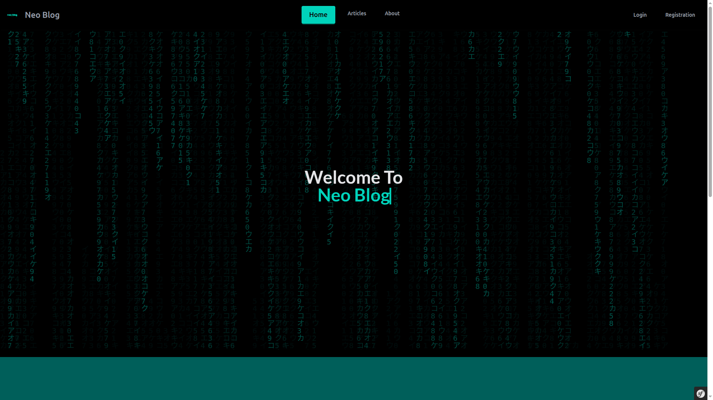
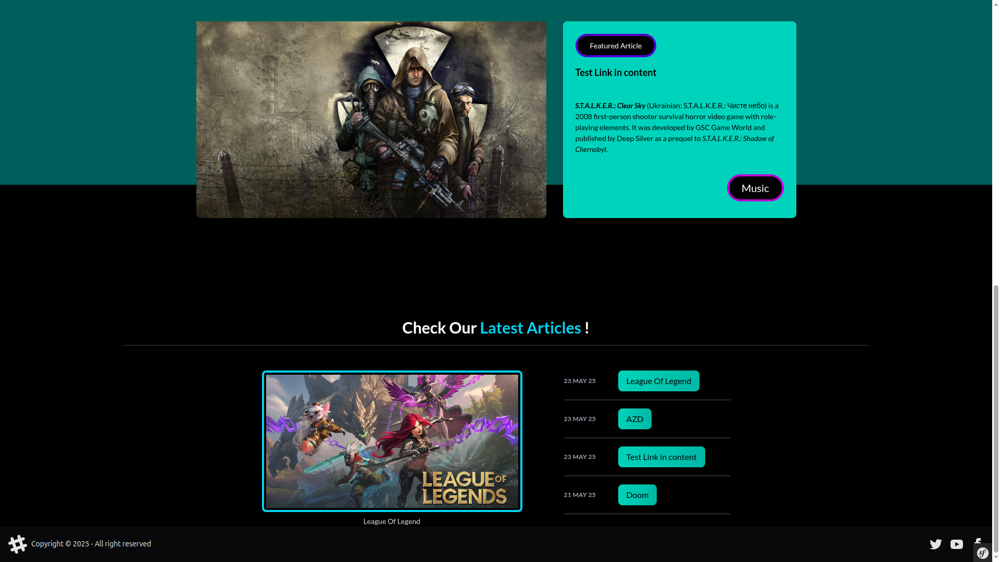
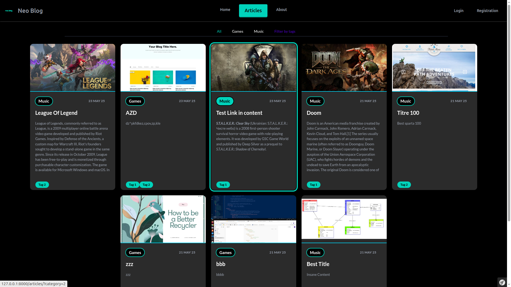
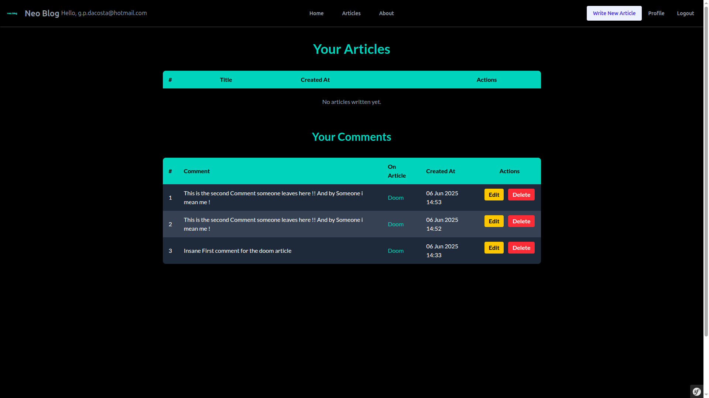
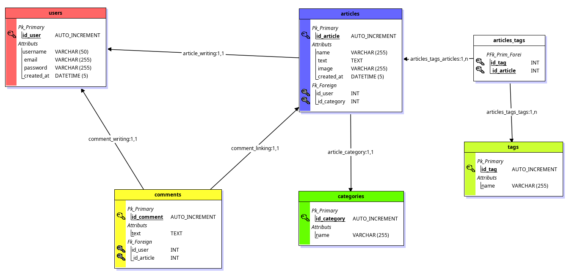

# 📚 Neoblog

[](https://symfony.com/)
[](https://www.php.net/)
[](LICENSE)
[](https://github.com/Hex-Umbra/Neoblog/commits/main)
[](https://github.com/Hex-Umbra/Neoblog)

---

## 📖 Description

**Neoblog** is a simple and modern blog web application built with the Symfony PHP framework. Created as a school project, it demonstrates core web development concepts like CRUD operations, routing, authentication, and Twig templating in Symfony.

---

## 🚀 Features

- User-friendly interface to read blog posts.
- Admin dashboard to create, edit, and delete posts.
- Categories and tags for articles.
- Comment system.
- Responsive design using Tailwind CSS and DaisyUI.
- AlpineJS for dynamic UI updates.

---

## 🛠️ Tech Stack

- **Backend:** PHP 8.2, Symfony 7
- **Frontend:** Twig, Tailwind, DaisyUI, AlpineJS, AOS (Animation on Scroll)
- **Database:** MySQL
- **Tools:** Composer, Symfony CLI

---

## 📥 Installation

### Prerequisites

- PHP 8.2+
- Composer
- Symfony CLI
- MySQL

### Steps

1. Clone the repository:
   ```bash
   git clone https://github.com/Hex-Umbra/Blog_Symfony.git

2. Install dependencies:    
    ```bash
    composer install
3. Set up environment variables in `.env` file:
   ```bash 
    cp .env .env.local
4. Set up database credentials in `.env.local` file
5. Create database:
   ```bash
   php bin/console doctrine:database:create
6. Run migrations:
    ```bash
    php bin/console doctrine:migrations:migrate
7. Start Server:
    ```bash
    symfony server:start

Access the project at http://127.0.0.1:8000

---

## 📸 Screenshots

### 🏠 Homepage




---

### 📄 Article Index Page

**Working on it**


---

### 📃 Article Show Page

**Working on it**


---

### 👤 User Profile

**Working on it**


---

### 🛠️ Admin Panel

**Working on it**


---

## 📁 Project Structure

```css
    Neoblog/
    ├── config/
    ├── migrations/
    ├── public/
    ├── screenshots/
    │ ├── homepage.png
    │ ├── article-index.png
    │ ├── article-show.png
    │ ├── user-profile.png
    │ └── admin-panel.png
    ├── src/
    │ ├── Controller/
    │ ├── Entity/
    │ ├── Repository/
    │ └── ...
    ├── templates/
    ├── var/
    ├── vendor/
    ├── .env
    ├── composer.json
    └── symfony.lock
```

## 📖 Documentation

This section describes the internal structure and logic of **Neoblog**, including its controllers, entities, relations, and key configurations.

---

### 📌 Routing & Controllers

Routes are primarily defined using PHP attributes in the `src/Controller/` directory.

**Available Controllers:**
- `ArticleController` → Manages article listing, details, and creation.
- `CommentController` → Manages article comments.
- `AboutController` → Displays static about page.
- `EmailConfirmationController` → Handles email verification links.
- `RegistrationController` → Manages user registration.
- `SecurityController` → Manages user profile, login, logout, and authentication.

---

### 📌 Entities & Database Structure

The application uses Doctrine ORM for database management, with the following main entities:

- `User` (id, username, email, password, roles, articles, comments)
- `Articles` (id, title, content, createdAt, updatedAt, category, user, tags, comments)
- `Comments` (id, content, createdAt, article, user)
- `Categories` (id, name, articles)
- `Tags` (id, name, articles)

---

### 📌 Entity Relationships

**Key Relationships:**
- One `User` can have many `Articles` and `Comments`.
- One `Article` belongs to one `User` and one `Category`.
- One `Article` can have many `Comments`.
- Many `Articles` can have many `Tags` (ManyToMany).
- One `Category` can have many `Articles`.

**Database Diagram:**



*Diagram shows entities and their relationships.*

---

### 📌 Security & Roles

Neoblog uses Symfony's Security component with role-based access:

- `ROLE_USER` → Regular users with article reading and comment permissions.
- `ROLE_ADMIN` → Admin users with additional rights for article management, category management, and user administration.

Role management and access control are handled via:
- Route annotations (`@IsGranted`) in controllers.
- `security.yaml` configuration.
- EasyAdmin dashboard access restricted to `ROLE_ADMIN` users.

### 📌 Admin Panel with EasyAdmin

Neoblog integrates the **EasyAdminBundle** for a fully functional, customizable administration panel.

**Key Features:**
- Manage `Articles`, `Categories`, `Tags`, `Comments`, and `Users` via an auto-generated, user-friendly interface.
- Easy customization of entity fields, form layouts, filters, and list displays.
- Access control restricted to `ROLE_ADMIN` users.

**Configuration:**
- `DashboardController` defines the admin dashboard layout.
- CRUD controllers for each entity are configured automatically by EasyAdmin via its dashboard and menu settings.


---

### 📌 Email Confirmation

The application includes an email verification system for new user registrations. Users must confirm their email address through a unique link before accessing restricted features.

Managed by:
- `EmailConfirmationController`
- Symfony Mailer component
- Email Templates for `New User` & `Forgotten Password`

---

### 📌 Commenting System

Articles support user comments. Each comment is linked to:
- The authenticated `User`
- The `Article` it belongs to

Comments are displayed in chronological order on the article show page.

---

---

## 👤 Author

**Hex-Umbra**
[GitHub](https://github.com/Hex-Umbra)

---

## ⭐️ Final Note

This project was created as part of a web development school assignment using Symfony 7 and aims to demonstrate clean code architecture, good practice in project organization, and a functional blogging platform.


<!-- # Objectives

1. [ ] - Make the Wireframe of the application in `Figma`
2. [x] - Making the controllers
    1. [x] - Creating the `HomeController`
    2. [x] - Creating the `ArticlesController`
    3. [ ] - Creating the `CommentsController`
    4. [ ] - Creating the `CategoriesController`
    5. [ ] - Creating the `TagsController`
    6. [ ] - Creating the `AboutController`
3. [x] - Making the models
    1. [x] - Creating the `User` model
    2. [x] - Creating the `Articles` model
    3. [x] - Creating the `Comments` model
    4. [x] - Creating the `Categories` model
    5. [x] - Creating the `Tags` model
4. [x] - Making the Relations between models
    1. [x] - Creating the relations between `User` and `Articles`
    2. [x] - Creating the relations between `Articles` and `Comments`
    3. [x] - Creating the relations between `Articles` and `Categories`
    4. [x] - Creating the relations between `Articles` and `Tags`
    5. [x] - Creating the relations between `Comments` and `User`
5. [x] - Making the Database
6. [x] - Making the migrations
7. [x] - Migrate
8. [ ] - Making the Crud for the controllers
    1. [ ] - For `ArticlesController`
       1. [x] - An `index` method with all articles
       2. [x] - A `new` method to create a new article
       3. [x] - An `edit` method with the articles information for updating
       4. [x] - A `show` method with one article details
       5. [x] - A `delete` method to delete an article
       6. [x] - Fuse Both `Edit` & `New` methods in one
       7. [x] - Eventually add a Pagination with 10 articles max per page
       8. [ ] - 
    2. [ ] - For `User`
      1.  [x] - For `User Registration` use a mailer system to confirm the email
      2.  [x] - For `User Login` with the mailer system make a a forgot password system
      3.  [ ] - Add Flash Message for `Registration`
      4.  [ ] - Add Flash Message for `Email Validation`
      5.  [ ] - Add Flash Message for `Email Password Reset`
      6.  [ ] - Add Flash Message for `Successful Password Reset`
      7.  [ ] - Add Flash Message for `Login`
      8.  [ ] - Add Flash Message for `Logout`
      9.  [ ] - Make a `User Profile`
          1.  [x] - Display all written articles
          2.  [ ] - Change the style to make it appealing
          3.  [ ] - Display all written comments and their related articles
          4.  [ ] - Display an `Edit` & `Delete` button actions besides the `Articles`
9.  [x] - Logged In and Registered Users can make `New Articles`
10. [ ] For `New Article`
    1.  [x] - Make sure the user can select and look for mulitple `Tags`
    2.  [x] - Delete the `User` select from the form, and add directly in the `ArticleController` the `User_ID` when saving the article
    3.  [x] - User can upload their image for the article, and we will save it to specified folder with each image having a `unique name`
11. [ ] - For `Filtering` Options in `Articles View Template`
    1.  [x] - When clicking on a `category` , show only the articles of that category
    2.  [x] - Choose one or mutliple `Tags` and show only the articles with chosen tags
    3.  [ ] - When clicking on a `user`, show only the articles of that user
12. [x] - For the admin dashboard use a package `(easyAdmin)`
13. [ ] - For `HomeController` && `Home View Template`
      1. [x] - a section with the featured article to show 
      2. [x] - A section about the most recent articles (4 max)
14. [ ] - For `Login` & `Registration`, add redirection links to each other
15. [x] - After adding email Confirmation, Add the `Forgot Password` feature
16. [ ] - Handle `Page Errors` Templates
    1.  [x] - 404
    2.  [x] - 403
    3.  [x] - 500


## Future Fixes
1. [ ] - Fix The Delete Modal for `Article` in `User Profile` when a user is connected. -->
